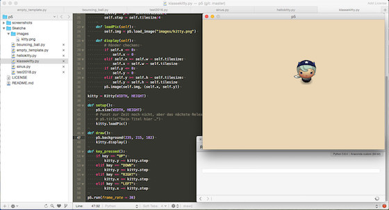

# Tutorial: Spaß mit P5 (Python)

Das [gestern](http://blog.schockwellenreiter.de/2018/11/2018111404.html) in mein Wiki aufgenommene [P5 (Python)](http://cognitiones.kantel-chaos-team.de/programmierung/creativecoding/processing/p5py.html)), der »echte« (C-) Python-Mode von [Processing](http://cognitiones.kantel-chaos-team.de/programmierung/creativecoding/processing/processing.html), ist zwar noch beta und auch noch unvollständig implementiert, aber dennoch schon so mächtig, daß man damit viel anfangen kann. Daher mußte ich gestern abend noch ein wenig damit herumspielen und experimentieren:

Herausgekommen ist ein kleines Programm mit einer Spielfigur, die mit Hilfe der Pfeiltasten im Bildschirmfenster manövriert werden kann. Wem das bekannt vorkommt -- es ist eines der Programme, mit denen ich seinerzeit [PyGame](http://cognitiones.kantel-chaos-team.de/multimedia/spieleprogrammierung/pygame.html) (und auch [Processing.py](http://cognitiones.kantel-chaos-team.de/programmierung/creativecoding/processing/processingpy.html)) [erkundet](http://blog.schockwellenreiter.de/2016/05/2016052003.html) [habe](http://blog.schockwellenreiter.de/2016/11/2016110904.html). P5 scheint das Zeug dazu zu haben, unter anderem auch so etwas wie der legitime Nachfolger von PyGame zu werden.

Also, was habe ich angestellt? Im Gegensatz zur [Dokumentation](https://p5.readthedocs.io/en/latest/index.html), die

~~~python
from p5 import *
~~~

empfiehlt, habe ich ein einfaches

~~~python
import p5
~~~

Statement verwendet. Ich mag nämlich die mit den *Wildcards* verbundene Namensraumverschmutzung nicht und das Präfix `p5.` ist ja auch schnell getippt. Und die Spielfigur habe ich von vorneherein in eine Klasse gekapselt, Der gesamte Sketch sieht daher so aus:

~~~python
import p5
import os

# Hier wird der Pfad zum Verzeichnis des ».py«-Files gesetzt
# Erspart einem das Herumgehample in TextMate mit dem os.getcwd()
# und os.path.join()
file_path = os.path.dirname(os.path.abspath(__file__))
os.chdir(file_path)

WIDTH = 630
HEIGHT = 450

class Kitty():
    
    def __init__(self, x, y):
        self.w = x
        self.h = y
        self.tilesize = 90  # Bildgröße: 90x90 Pixel
        self.x = x/2 - self.tilesize/2
        self.y = y/2 - self.tilesize/2
        self.step = self.tilesize/4
    
    def loadPic(self):
        self.img = p5.load_image("images/kitty.png")

    def display(self):
        # Ränder checken:
        if self.x <= 0:
            self.x = 0
        elif self.x >= self.w - self.tilesize:
            self.x = self.w - self.tilesize
        if self.y <= 0:
            self.y = 0
        elif self.y >= self.h - self.tilesize:
            self.y = self.h - self.tilesize
        p5.image(self.img, (self.x, self.y))

kitty = Kitty(WIDTH, HEIGHT)

def setup():
    p5.size(WIDTH, HEIGHT)
    # Funzt zur Zeit noch nicht, aber das nächste Release
    # soll den Titel wieder anzeigen.
    # p5.title("Dein Titel hier …")
    kitty.loadPic()

def draw():
    p5.background(235, 215, 182)
    kitty.display()

def key_pressed():
    if key == "UP":
        kitty.y -= kitty.step
    elif key == "DOWN":
        kitty.y += kitty.step
    elif key == "RIGHT":
        kitty.x += kitty.step
    elif key == "LEFT":
        kitty.x -= kitty.step

p5.run(frame_rate = 30)
~~~

Einiges bedarf vielleicht der Erläuterung: `p5.title()` zeigt momentan nur den ersten Buchstaben des Titels an, daher habe ich dieses Kommando auskommentiert. Der Bug ist aber [bekannt](https://github.com/p5py/p5/issues/63) und soll mit dem nächsten Release behoben werden. Außerdem sind einige P5-Konstanten und -Variablen global (wie zum Beispiel `key`), sie dürfen daher **nicht** mit dem Präfix `p5.` versehen werden. Die [Reference](https://p5.readthedocs.io/en/latest/reference/index.html) gibt darüber in der Regel Auskunft.

Und *last but not least* ist die Namenskonvention *pythonisch* -- sie folgt der [PEP 8](https://www.python.org/dev/peps/pep-0008/#descriptive-naming-styles), das heißt statt des in Processing (Java) üblichen *CamelCase* gibt es den Unterstrich, also `frame_rate` statt `frameRate`.

Ich nutzte ja den freien Editor [TextMate 2](http://cognitiones.kantel-chaos-team.de/produktivitaet/textmate.html) und ich kann direkt aus diesem Editor heraus die Python-Sketche starten. Das ist fast genau so komfortabel wie die Processing-IDE (PDE), die ich daher kaum vermisse. Aber auch andere freie Editoren wie zum Beispiel [Atom](http://cognitiones.kantel-chaos-team.de/produktivitaet/atom.html) und [Visual Studio Code](http://cognitiones.kantel-chaos-team.de/produktivitaet/visualstudiocode.html) erlauben dies, daher könnt Ihr den Editor nehmen, mit dem Ihr verwachsen seid.

Das Bild der *Kitty* alias *»Horn Girl«* stammt wieder aus dem von *Daniel Cook (Danc)* in seinem Blog *[Lost Garden](http://www.lostgarden.com/search/label/free%20game%20graphics)* unter einer [freien Lizenz](http://www.lostgarden.com/2007/03/lost-garden-license.html) ([CC BY 3.0 US](http://creativecommons.org/licenses/by/3.0/us/)) zu Verfügung gestellten Tileset [Planet Cute](http://www.lostgarden.com/2007/05/dancs-miraculously-flexible-game.html). Ich habe es nur noch ein wenig auf die Größe von 90x90 Pixeln zurechtgeschnitten.

**Fazit**: P5 (Python) macht Spaß. Daher wird dies sicher nicht der letzte Beitrag dazu sein, den Ihr in diesem <del>Blog</del> Kritzelheft lesen werdet. Ich habe dafür auf GitHub schon einemal ein [Repositorium](https://github.com/kantel/p5) angelegt. *Still digging!*