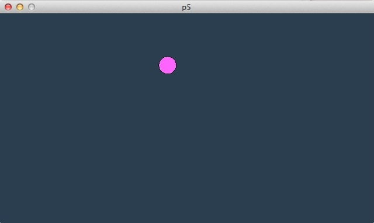
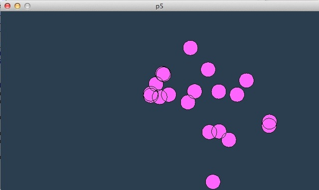

# P5-Tutorial 01: Vektoren mit P5 (Python)

[P5 (Python)](http://cognitiones.kantel-chaos-team.de/programmierung/creativecoding/processing/p5py.html) hat mich so inspiriert, daß ich angefangen habe, die Processing (Java) Beispielprogramme aus *Daniel Shiffmans* wunderbarem Buch »The Nature of Code« mit P5 nachzuprogrammieren. Dieses Tutorial ist das erste einer geplanten Reihe und soll gleichzeitig so etwas wie ein Streßtest sein, um die Leistungsfähigkeit und Fehlerfreiheit von P5 zu testen, schließlich ist die Software noch *beta*.

Zwar besitzt natürlich auch P5 eine Vektoren-Klasse (sogar für zwei- **und** dreidimensionale Vektoren), aber da ich – ursprünglich für die [Nodebox 1](http://cognitiones.kantel-chaos-team.de/programmierung/creativecoding/nodebox/nodebox.html) – schon einmal die Klasse `PVector` nachprogrammiert hatte, habe ich auf sie zurückgegriffen. Sie hat keine Abhängigkeiten von P5 und funktioniert damit auch mit anderen Python-Paketen. Allerdings unterstützt diese nur zweidimensionale Vektoren, aber für meine Fälle reicht dies aus.

Über diese Klasse `PVector` hatte ich schon mehrmals berichtet (zuletzt [hier](http://blog.schockwellenreiter.de/2018/11/2018111902.html) und [hier](http://blog.schockwellenreiter.de/2018/11/2018112301.html)), daher setze ich sie für dieses Tutorial einfach als bekannt voraus. Ihr könnt sie Euch von meinem [GitHub-Repo](https://github.com/kantel/pvector) herunterladen und das *Readme* dort enthält auch eine kleine Dokumentation der Klasse.

Das Hauptprogramm in diesem Teil ist immer gleich, lediglich die Klasse `Mover` enthält die jeweiligen Änderungen. Das Programm (ohne die Klasse `Mover` sieht so aus:

~~~python
import p5
from pvector import PVector

def setup():
    global mover
    p5.size(640, 360)
    mover = Mover()

def draw():
    p5.background(43, 62, 80)
    
    mover.update()
    mover.check_boundaries()
    mover.display()

p5.run()
~~~

In der ersten Version ist der `mover` lediglich ein Kreis, der nach einer zufälligen Anfangsorienterung über den Bildschirm huscht:

~~~python
class Mover(object):
    
    def __init__(self):
        self.location = PVector(p5.random_uniform(width), p5.random_uniform(height))
        self.velocity = PVector(p5.random_uniform(-5, 5), p5.random_uniform(-5, 5))
        self.r = 15
    
    def update(self):
        self.location.add(self.velocity)
    
    def display(self):
        p5.stroke(0)
        p5.fill(255, 100, 255)
        p5.circle((self.location.x, self.location.y), 2*self.r)
    
    def check_boundaries(self):
        if (self.location.x > width + self.r):
            self.location.x = -self.r
        elif (self.location.x < -self.r):
            self.location.x = width + self.r
        
        if (self.location.y > height + self.r):
            self.location.y = -self.r
        elif (self.location.y < -self.r):
            self.location.y = height + self.r
~~~

Da dies ja ein P5-Tutorial ist, habe ich für die Zufallszahlen die Funktion `random_uniform()` aus dem P5-Modul ausgewählt, ich hätte natürlich genauso gut Pythons Standardbibliothek `random` importieren können und die Funktion `random.uniform()` dafür nehmen können [^1].

[^1]: Ich vermute, `p5.random_uniform()` ist sowieso nur ein Wrapper zu `random.uniform()` aus der Standardbibliothek.

Der Konstruktor wählt in diesem Anfangsbeispiel einen zufälligen Startpunkt (als Vektor) und eine zufällige Bewegungsrichtung und Geschwindigkeit (ebenfalls als Vektor) aus. Außerdem setzt er den Radius des Kreises auf 15 Pixel fest.

Die `update()`-Methode addiert den Richtungs- und Geschwindigkeitsvektor (`velocity`) zum Ortsvektor (`location`) hinzu.

`display()` ist eine ganz einfache Nethode, die einfach nur den Kreis an den Punkt, auf den der Ortsvektor weist, zeigt.

Die Methode `check_boundaries()` habe ich gegenüber der Version von *Daniel Shiffman* leicht verändert: Der Kreis soll erst vollständig aus dem Bildschirmfenster verschwunden sein, bevor er auf der gegenüberliegenden Seite wieder auftaucht. Das ergibt die Illusion einer flüssigeren Bewegung.

Und so gleitet der lila-farbene Kreis majästetisch über das Fenster. Dies mag zwar zuerst einmal den Programmierer erfreuen, wird natürlich aber auf Dauer etwas langweilig. Daher habe ich in einer zweiten Version dem Kreis auch noch einen Beschleunigungsvektor (`acceleration`) verpaßt. Dafür waren nur wenige Änderungen an der Klasse `Mover` notwendig:

~~~python
class Mover(object):
    
    def __init__(self):
        self.location = PVector(width/2, height/2)
        self.velocity = PVector(0, 0)
        self.acceleration = PVector(-0.001, 0.01)
        self.topspeed = 10
        self.r = 15
    
    def update(self):
        self.velocity.add(self.acceleration)
        self.velocity.limit(self.topspeed)
        self.location.add(self.velocity)
~~~

Nun startet der Kreis in der Mitte des Fensters und der Geschwindigkeits und Richtungsvektor verharrt zu Beginn auf `(0, 0)`. Die Beschleunigung wird in P5 bei jedem Frame-Durchlauf dazuaddiert, daher muß sie relativ klein ausfallen. Doch selbst dann wird sie sehr schnell immer größer, daher habe ich ihr mit `topspeed` ein Limit gesetzt.

In der `update()`-Methode wird erst die Beschleunigung zur Geschwindigkeit hinzuaddiert, dann wird überprüft, ob sie das Limit erreicht hat und schließlich – wie gehabt – ändert sie durch Addition den Ortsvektor.

Wenn Ihr dieses Skript laufen laßt, fällt der Kreis erst langsam nach links unten, taucht dann pben wieder auf und wird schneller und schneller bis er das Limit erreicht hat. Nun ist schon etwas mehr Dynamik im Skript.

Aber was wäre, wenn sich die Beschleunigung nicht um einen konstanten Vektor, sondern bei jedem Durchlauf zufällig ändert? Auch dafür mußte ich nur wenige Änderungen an der Klasse `Mover` vornehmen:

~~~python
class Mover(object):
    
    def __init__(self):
        self.location = PVector(width/2, height/2)
        self.velocity = PVector(0, 0)
        self.acceleration = PVector(0, 0)
        self.topspeed = 10
        self.r = 15
    
    def update(self):
        self.acceleration = PVector.random2D()
        # self.acceleration.mult(0.5)
        self.acceleration.mult(p5.random_uniform(2))
        self.velocity.add(self.acceleration)
        self.velocity.limit(self.topspeed)
        self.location.add(self.velocity)
~~~

Zuerst einmal habe ich im Konstruktor auch die Beschleunigung mit `(0, 0)` vorbelegt, um ihr dann in der `update()`Methode bei jedem Durchlauf mit der Klassenmethode `PVector.random(2D()` einen zufälligen, normierten Vektor der Länge 1 zuzuweisen. Diesen kann ich entweder mit der auskommentierten Zeile

~~~python
self.acceleration.mult(0.5)
~~~

auf eine konstante Länge normieren oder aber ich kann ihm mit

~~~python
self.acceleration.mult(p5.random_uniform(2))
~~~

auch jedesmal noch eine zufällige Länge zuweisen. Die letzte Methode ergibt auf jeden Fall ein interessanteres Verhalten des Kreises, der nun völlig unberechenbar durch das Fenster torkelt.

Als nächsten Schritt wollte ich, daß der Kreis der Maus folgt. Auch hierzu waren nur wenige Änderungen in der Klasse `Mover` erforderlich:

~~~python
class Mover(object):
    
    def __init__(self):
        self.location = PVector(width/2, height/2)
        self.velocity = PVector(0, 0)
        self.acceleration = PVector(0, 0)
        self.topspeed = 8
        self.r = 15
    
    def update(self):
        mouse = PVector(mouse_x, mouse_y)
        dir = mouse - self.location
        dir.normalize()
        dir.mult(0.5)
        self.acceleration = dir
        self.velocity.add(self.acceleration)
        self.velocity.limit(self.topspeed)
        self.location.add(self.velocity)
~~~

Der Konstruktor ist nahezu unverändert gebliebn, nur an der Höchstgeschwindigkeit habe ich etwas geschraubt (der Kreis wäre mir sonst zu weit aus dem Fenster hinausgeschossen).

In der `update()`-Methode habe ich erst einmal die Maus-Koordinaten ebenfalls in einen Vektor gepackt. Mit der (statischen) Vektorsubtraktion

~~~python
dir = mouse - self.location
~~~

und der anschießenden Normalisierung erzeuge ich einen Vektor der Länge 1, der vom Kreis auf den Mauszeiger zeigt. Der Rest funktioniert wie gehabt.

Wenn Ihr nun mit diesem Skript spielt, werdet Ihr feststellen, daß der Kreis nie zur Ruhe kommt. Wenn der Mauszeiger sich nicht bewegt, hüpft der Kreis immer über die Maus hin und her. Das liegt daran, daß in dieser Simulation noch kein Reibungsverlust eingebaut wurde. Dies werde ich in einer späteren Folge nachholen.

*Last but not least* ist natürlich ein Kreis auf dem Bildschirmfenster langweilig, viel schöner wäre es doch, wenn viele Kreise wie ein Schwarm dem Mauszeiger folgen würden. Das habe ich in dem letzten Skript programmiert, bei dem auch das Hauptprogramm geändert werden mußte. Dafür änderte sich in der `Mover`-Klasse nur der Konstruktor, damit die einzelnen Kreise an zufälligen Positionen erscheinen:

~~~python
class Mover(object):
    
    def __init__(self):
        self.location = PVector(p5.random_uniform(width), p5.random_uniform(height))
        self.velocity = PVector(0, 0)
        self.acceleration = PVector(0, 0)
        self.topspeed = 4
        self.r = 15
~~~

Im Hauptprgramm mußten aber sowohl in der `setup()`- wie auch in der `draw()`-Funktion Änderungen vorgenommen werden:

~~~python
numMovers = 20
movers = []

def setup():
    global mover
    p5.size(640, 360)
    for _ in range(numMovers):
        movers.append(Mover())

def draw():
    p5.background(43, 62, 80)
    
    for mover in movers:
        mover.update()
        mover.check_boundaries()
        mover.display()
        
p5.run()
~~~

Wenn Ihr das Programm so laufen laßt, werdet Ihr feststellen, daß die Kreise wieder weit über das Ziel hinausschießen. Ich habe daher noch einmal an den Parametern geschraubt.

Für mich zufriedenstellende Ergebnisse brachte einmal ein weiteres Herabsetzen der zulässigen Höchstgeschwindigkeit im Konstruktor mit

~~~python
self.topspeed = 4
~~~

und eine weitere Verkleinerung des Normierungsfaktors in der `update()`-Methode:

~~~python
dir.mult(0.1)
~~~

Die zwanzig Kreise zogen noch flüssig über meinen Monitor, brachten aber die Kühlung meines betagten MacBook Pros aus dem Jahre 2009 ganz schön ins Blasen. Auf neueren und leistungsfähigeren Rechnern dürfte da aber auch noch Luft nach oben sein. Schraubt daher ruhig an den Parametern weiter herum und entdeckt, welchen Einfluß sie auf das Programmgeschehen haben.

Den Quellcode dieser Skripte findet Ihr ebenfalls auf GitHub in meinem [P5-Repositorium](https://github.com/kantel/p5).
